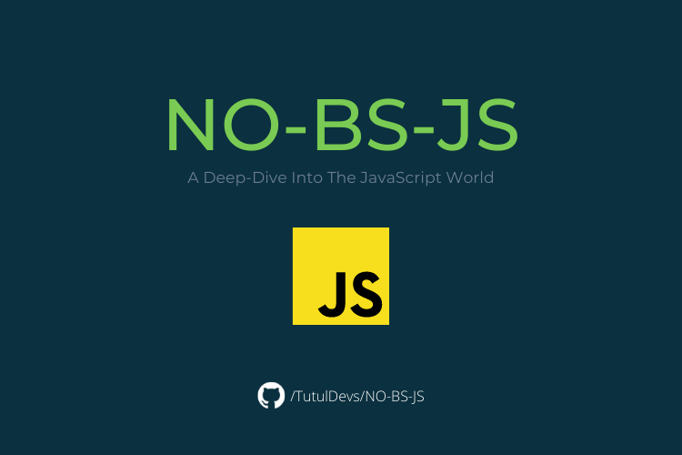

  

# NO-BS-JS

For a long time, I was planning to take a deep dive into JavaScript. I'm doing it now and documenting my notes in this repository.

I started this adventure with the Data types. Later I will go into all the important concepts including how JavaScript works behind the scenes. Finally I will start problem solving in **Leetcode**.

This repository is nothing but my notes and thoughts. I hope my notes will be useful for some people.

I will post the updates in my [Twitter profile](https://twitter.com/TutulDevs) and [Linkedin profile](https://www.linkedin.com/in/tutuldevs/). Feel free to connect there.

⚠ Caution: I'm a bad note taker. So, if you find any misinformation or oddity, please let me know. I'm here to grow and help others. 🙏

If you're being benefited, don't by shy to give it a ⭐. It gives me dopamine 😉
